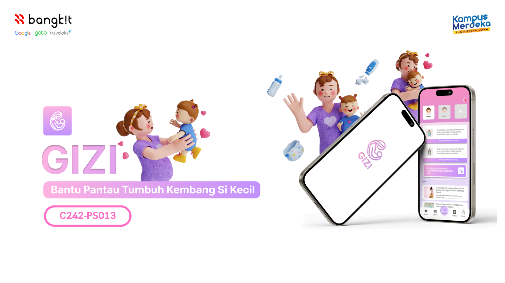
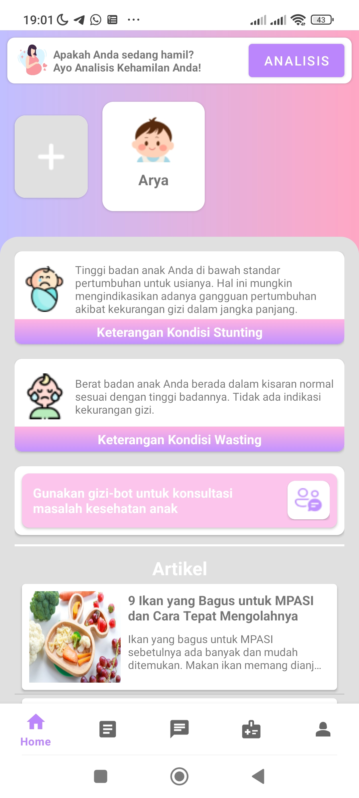
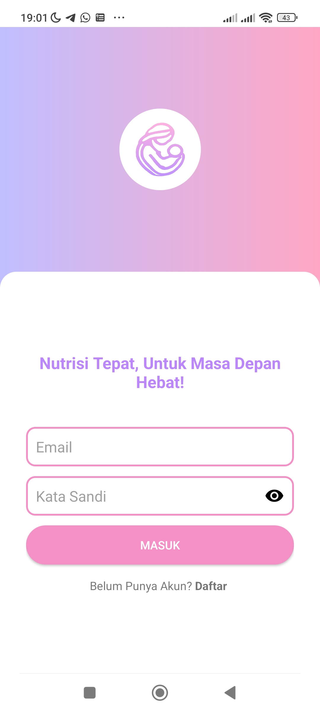
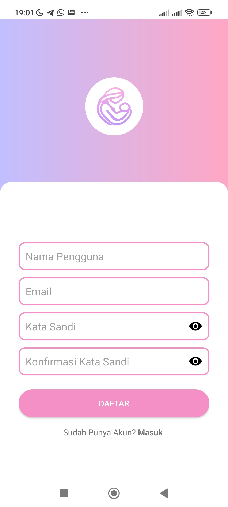
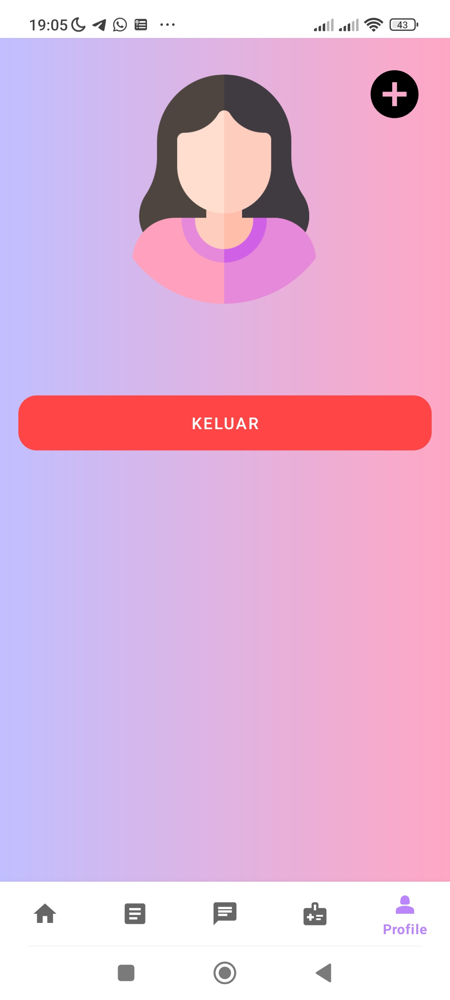

<h1 align="center">
  
 
Gizi: Generasi Indonesia Zero Stunting 
</h1>

# Introduction
Gizi (Generasi Indonesia Zero Stunting & Wasting) is an AI-based application designed to support the detection, treatment, and prevention of stunting and wasting in children. The app focuses on the first 1000 days of life, providing stunting risk analysis using machine learning models, treatment recommendations in the form of health education articles. With smart chatbot features and SDG (Sustainable Development Goals) based data integration, Gizi helps improve maternal and child health in Indonesia.

# Team Universitas Halu Oleo 🚀

Explore our team members by specialization:

- **[🎓 Machine Learning](#machine-learning-team)**
- **[📱 Mobile Development](#mobile-development-team)**
- **[☁️ Cloud Computing](#cloud-computing-team)**

---

## 🎓 Machine Learning Team  
- **[Jabir Muktabir](https://www.linkedin.com/in/jabir-muktabir/)**  
  *ID*: M206B4KY2033  
- **[Arya Dwinata Mustapa](https://www.linkedin.com/in/arya-dwinata-mustapa/)**  
  *ID*: M206B4KY0675  
- **[Argitha Trihapsari](https://www.linkedin.com/in/argitha-trihapsari-793898332/)**  
  *ID*: M206B4KX0618  

## 📱 Mobile Development Team  
- **[Amar Adi Ismoyo](https://www.linkedin.com/in/adismoyam/)**  
  *ID*: A206B4KY0456  
- **[Reksa Leo Saputra](https://www.linkedin.com/in/reksa-leo-saputra-3a3b13285/)**  
  *ID*: A206B4KY3740  

## ☁️ Cloud Computing Team 
- **[Irfan](#)**  
  *ID*: C206B4KY2000  
- **[Jumain Zulkaidah](https://www.linkedin.com/in/jumain-zulkaidah-615489335/)**  
  *ID*: C206B4KY2115  

# GIZI

Welcome to **GIZI**! This app provides innovative solutions to enhance user experience. Here are the features and libraries we used:

## Features

### 1. Chatbot Integration
Interact with our intelligent chatbot for instant assistance and seamless communication.

  
  

- **Key Feature:** Dynamic responses with typing animations.
- **Libraries Used:**
  - [Retrofit](https://square.github.io/retrofit/) - For API communication.
  - [OkHttp](https://square.github.io/okhttp/) - For efficient network handling.
  - [Glide](https://github.com/bumptech/glide) - For loading chatbot avatars.

---

### 2. Splash Screen Animation
Enjoy a sleek splash screen with SVG or video animations for a modern app opening experience.

  

- **Key Feature:** Smooth and visually appealing app launch.
  - [VideoView](#) - For Load video splash screens.

---

### 3. User-Friendly Interface
An intuitive design that adapts seamlessly to all screen sizes and provides effortless navigation.

  
  
  

- **Key Feature:** Adaptive layouts for an exceptional user experience.
- **Libraries Used:**
  - [Material Components](https://material.io/components/) - For UI elements.
  - [ConstraintLayout](https://developer.android.com/reference/androidx/constraintlayout/widget/ConstraintLayout) - For responsive designs.

---

### 4. Data Synchronization
Your data is always in sync with our cloud-based architecture.

  
  

- **Key Feature:** Real-time updates and offline support.
- **Libraries Used:**
  - [Room](https://developer.android.com/jetpack/androidx/releases/room) - For local database.
  - [Firebase Realtime Database](https://firebase.google.com/products/realtime-database) - For cloud synchronization.

## How to Build

1. Clone the repository.
2. Open the project in Android Studio.
3. Build the project and run it on your emulator or device.

## Screenshots

Other Screenshot:

---

Crafted with ❤️ by the development team.